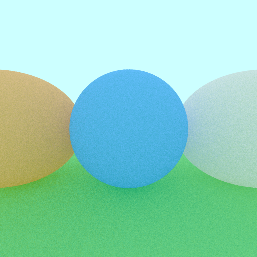
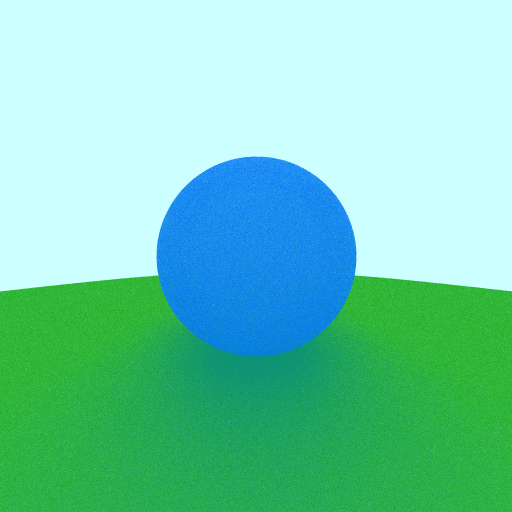
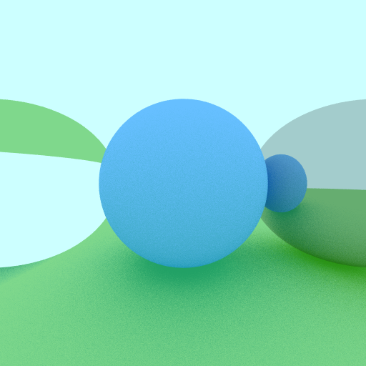

# Ray Tracer

A simple ray tracer written in Rust. It only supports the sphere primitive and lambertian, metallic and dielectric materials. There is no support yet for lighting and shadows, arbitrary camera positioning, depth-of-field or motion blur.

## Results (All images rendered with 32x anti-aliasing and max recursive depth of 10)

### 100% diffuse reflectance. 

### Lambertian material. 

### Lambertian and Reflective (Metallic) material. 

### Refractive (Dielectric) material.

