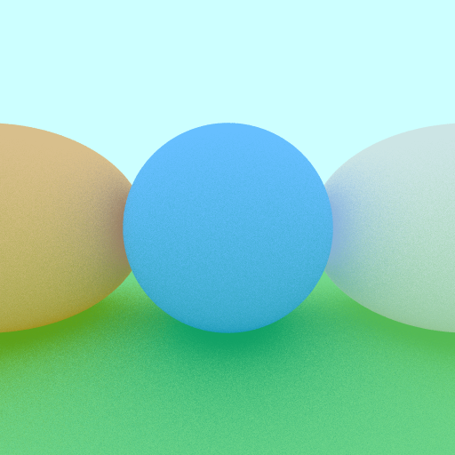

# Ray Tracer

A simple ray tracer written in Rust.

## Results

### 100% diffuse reflectance. 32x anti-aliasing. Max recursive depth 10.

### Lambertian materials. 32x anti-aliasing. Max recursive depth 10.

### Lambertian and Reflective materials. 32x anti-aliasing. Max recursive depth 10.

